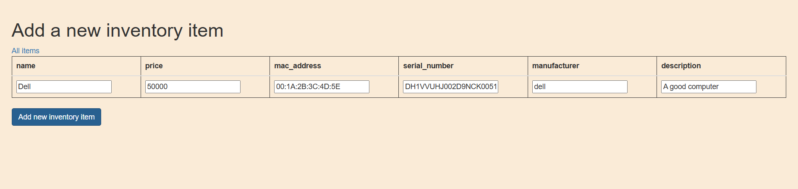
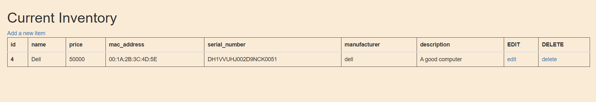
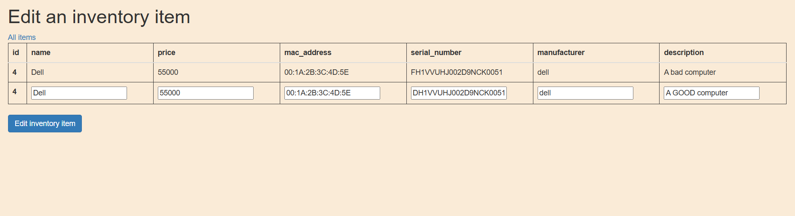
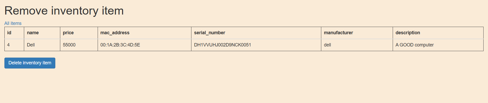

# Prerrequisites
Have docker installed and running

# Instructions
* Open a terminal in "PruebaTecnicaAHT" and then execute  ```docker compose up --build``` or alternatively ```docker compose up --build -d``` to execute it in the background.
* head to http://127.0.0.1:5000/

# Views




